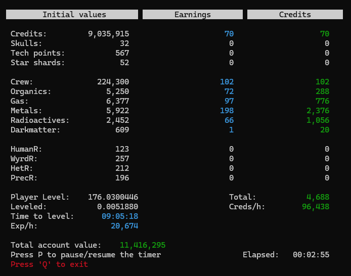

# TIB2Farmer

TIB2Farmer is a simple, open-source terminal application for Windows that automatically tracks resources in the game [**The Infinite Black 2**]. It's designed to be lightweight and easy to use.

**Note:** This project is currently in *alpha*. It may have bugs and is subject to change.

## Features

*   Automatic resource tracking in [**The Infinite Black 2**].
*   Simple, terminal-based interface.
*   Attempts to resume tracking after disconnections.

## Installation

1.  **Download:** Download the latest release of TIB2Farmer from the [Releases](https://github.com/will0w7/tib2farmer/releases) section of this repository. *Make sure to download the compiled executable (.exe), not the source code.*
2.  **Run:**  No installation is required. Simply double-click the downloaded `.exe` file (after running the game).
3. **Windows Terminal (Recommended):** For the best experience, it's recommended to use the Windows Terminal app. You can download it from the Microsoft Store: [Windows Terminal](https://apps.microsoft.com/detail/9n0dx20hk701)

## Usage

1.  **Normal Mode:** Open [**The Infinite Black 2**] and log in. Then, launch TIB2Farmer. The resource counter will start automatically.
2.  **Secret Mode:** Launch TIB2Farmer *before* opening [**The Infinite Black 2**]. This will display the current values of all your coins and resources. It's not a feature itself, but can be useful.

**Important Notes:**

*   If you experience a disconnection, TIB2Farmer will attempt to resume tracking.

## FAQ

**Q: Is TIB2Farmer safe for my PC?**

A: Yes. TIB2Farmer is a simple application that only reads information from the game memory (RAM). It does not modify any game files or access any personal data. The source code is open-source and available for review on GitHub.

**Q: What programming language is TIB2Farmer written in?**

A: TIB2Farmer is written in C.

**Q: Is the source code available?**

A: Yes! You can find the source code on GitHub: [TIB2Farmer](https://github.com/will0w7/tib2farmer)

**Q: Why doesn't the app have an icon?**

A: An icon was originally included, but it significantly increased the file size. To keep TIB2Farmer lightweight, the icon was removed.

**Q: Will TIB2Farmer work on my PC?**

A: TIB2Farmer is designed for **Windows only**. It has been tested on Windows 11 (including 24H2) and Windows 10. It may not work on older versions of Windows or other operating systems (e.g., Linux, macOS). The application has been tested with both the Steam version and the version downloaded from tib2.com.

## Important Considerations

1.  **Alpha Status:** TIB2Farmer is currently in alpha. It may contain bugs.
2.  **Game Updates:**  After a game patch, TIB2Farmer may require an update to function correctly.
3.  **Development:**  This project is developed in my free time. I welcome suggestions, but I cannot guarantee that all feature requests will be implemented. I aim to keep TIB2Farmer as simple and focused as possible.
4.  **Supported Platforms:** TIB2Farmer is primarily tested on Windows 11 (24H2) with both the Steam and tib2.com versions of the game. Compatibility with Windows 10 and older versions is not guaranteed.

## Issues and Support

If you encounter any problems or have suggestions, please **create a GitHub issue** on this repository. This helps me keep track of everything in one place. Please avoid contacting me privately.

## Dependencies / Acknowledgements

This application uses the following libraries:

*   **PDCursesMod:** A modified version of PDCurses. Public Domain. Thanks to the maintainers and contributors. [https://github.com/Bill-Gray/PDCursesMod](https://github.com/Bill-Gray/PDCursesMod)
*   **PDCurses (original):** Public Domain. Thanks to the original authors.

## License

This project (TIB2Farmer) is licensed under the MIT License - see the [LICENSE](LICENSE) file for details.
